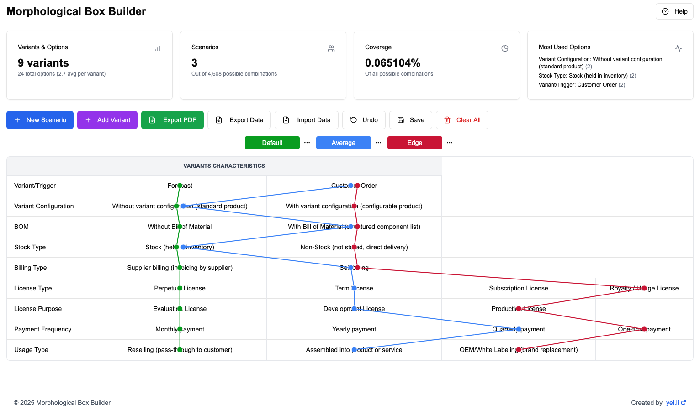

# 🧠 Morphological Box Builder

A flexible, interactive tool for scenario generation using morphological analysis. This application helps users explore complex problem spaces by breaking them down into variants and options, enabling structured creativity and systematic exploration.

## 🚀 Features

- **Variants & Options Management**  
  Create and manage multiple variants and their corresponding options to build a morphological field.

- **Scenario Generation**  
  Combine options into scenarios to simulate real-world cases — like default, edge, or average scenarios.

- **Visualization**  
  Visual interface to navigate and edit variant-option relationships and scenario configurations.

- **Data Persistence**  
  Auto-saves data in local storage, with support for import/export in JSON format.

- **Export Capabilities**  
  Download your morphological analysis as a PDF for documentation or presentation.

- **Undo & Redo**  
  Easy mistake recovery with undo functionality.

## 📊 Example Use Case

You're designing a complex B2B software licensing model. Using the Morphological Box Builder, you can:

- Define variants like "License Type", "Billing Type", "Fulfillment Method", etc.
- Add all possible options per variant.
- Build and compare different licensing scenarios.
- Export findings for stakeholders or implementation.

### 🖼️ Screenshot

Here’s what the app looks like with three configured scenarios (Default, Average, Edge):

